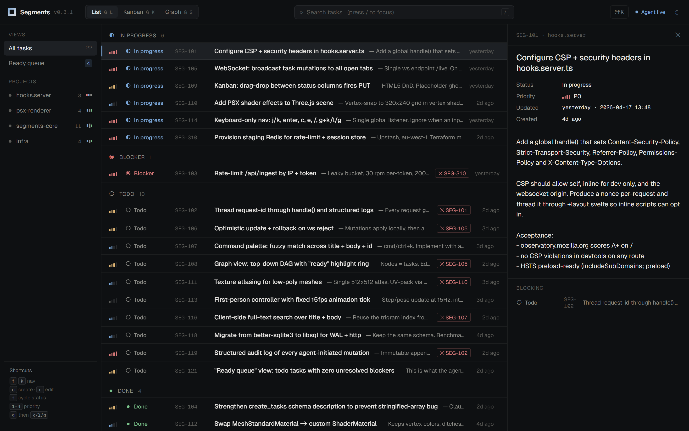
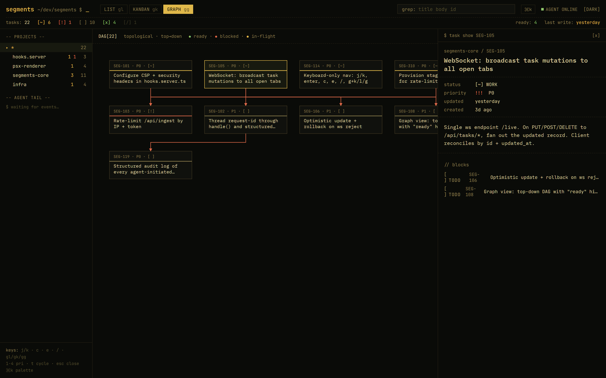
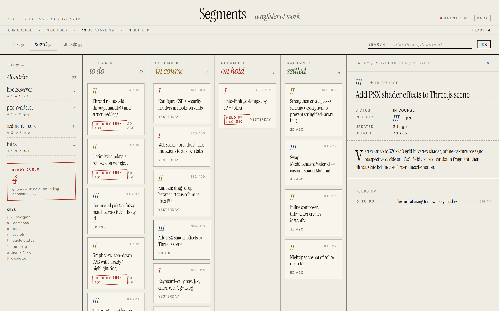

<div align="center">


# Segments

[](LICENSE)
[](#status)

A performant, lightweight, single-binary task and project manager.
Built as a faster, leaner alternative to Beads.

</div>

## Status

**Segments is a work in progress.** The core is stable enough that I use it daily, but it has not had wide exposure yet, so builds and tagged releases are expected to ship with bugs. If you hit one, please [open an issue](https://git.nocfa.net/NocFA/segments/issues/new/choose) -- the template will prompt for OS, architecture, `sg version` output, and repro steps. Fast feedback is the quickest way to sand down the rough edges.

## Why

Got fed up with Beads. It's slow, it's heavy, and it leans on a Dolt DB infrastructure that's miserable to live with. Segments is a leaner, faster alternative: same job, single binary, LMDB under the hood, no Dolt, no fuss. It's especially nice for solo power users, but nothing stops you from reverse-proxying the dashboard for a team, or orchestrating downstream actions off its state.

## Features

- Projects and tasks with priorities, statuses, dependency chains, and rich-text bodies
- Three interchangeable web themes (Obsidian, Console, Dossier) with light and dark modes
- Three views: grouped **List**, drag-and-drop **Kanban**, and top-down dependency **Graph**
- Ready-queue filter (tasks with no outstanding blockers)
- Real-time updates over WebSocket: edits from one tab or the CLI show up live everywhere
- Keyboard-first navigation: `j` `k` `c` `e` `/` `Esc` `Enter`
- MCP server for Claude Code (auto-resolves the current project, bulk task creation with `#0..#N` cross-references)
- Pi extension, embedded in the binary, for task-aware AI sessions
- OpenCode MCP integration
- Auto-start service (opt-in: launchd, systemd, or Windows Task Scheduler)
- Single binary, no external runtime dependencies, LMDB-backed storage

## Preview

Three themes, three views, same live data.


*Obsidian &middot; List &mdash; dark cool-steel chrome, grouped by status, detail panel open.*

<details>
<summary><strong>Console &middot; Graph</strong> &mdash; amber phosphor CRT, top-down dependency DAG with live agent tail. <em>(click to expand)</em></summary>



</details>

<details>
<summary><strong>Dossier &middot; Kanban</strong> &mdash; editorial paper-and-ink, serif display, five-column board. <em>(click to expand)</em></summary>



</details>

## Install

### macOS / Linux

```bash
curl -fsSL https://git.nocfa.net/NocFA/segments/raw/branch/main/scripts/install.sh | bash
```

Downloads a pre-built binary for your platform. Falls back to building from source if no binary is available.

**Prerequisites (source build only):** [Go 1.24+](https://go.dev/dl/) and a C compiler (CGO_ENABLED=1 is required for LMDB).

### Windows

```powershell
powershell -ExecutionPolicy Bypass -Command "irm https://git.nocfa.net/NocFA/segments/raw/branch/main/scripts/install.ps1 | iex"
```

Downloads a pre-built binary. Falls back to building from source if no binary is available. Installs to `%USERPROFILE%\.local\bin` and adds it to the user PATH.

**Prerequisites (source build only):** the script auto-installs missing dependencies via [winget](https://learn.microsoft.com/en-us/windows/package-manager/winget/):

- [Go 1.24+](https://go.dev/dl/) via `winget install GoLang.Go`
- [MinGW-w64 (GCC)](https://winlibs.com/) via `winget install BrechtSanders.WinLibs.POSIX.UCRT`

Git and winget ship with Windows 10/11.

### From source (any platform)

```bash
git clone https://git.nocfa.net/NocFA/segments.git
cd segments
make install
```

Requires Go 1.24+ and a C compiler (CGO_ENABLED=1 for LMDB).

## Quick start

```bash
sg setup    # configure integrations (Pi, Claude Code, OpenCode)
sg start    # start the server
```

Open <http://localhost:8765>.

## Usage

```
sg help

  Server
    start         start the server    (serve)
    stop          stop the server

  Tasks
    list          list projects and tasks    (status)
    view          view full task details
    add           create a task
    done          mark a task as done
    close         close a task
    rename        rename a project

  Setup
    setup         configure integrations    (install)
    init          initialize a project in the current directory
    beads         import tasks from Beads
    remove        remove a project
    uninstall     remove segments and all data

  Info
    help          show help
    version       print version
```

`sg list` auto-detects the current project from the working-directory name. Pass `-a` to include completed tasks. Passing a task-ID prefix to `list` falls through to `view`.

`sg view <id>` prints the task's title, status, priority, blockers, timestamps, and body.

## Web UI

Open <http://localhost:8765> and pick a theme from the dropdown in the top bar.

| Theme | Vibe |
|-------|------|
| **Obsidian** | Refined near-black chrome with a cool-steel accent (default) |
| **Console** | Amber phosphor, monospace, ASCII framing, live agent tail |
| **Dossier** | Editorial paper-and-ink, serif display, rubber-stamp accents |

All three themes support a light and a dark mode; toggle with the sun/moon button.

### Views

- **List**: tasks grouped by status, from in-progress through blocker, todo, done, and closed. Inline priority bars, blocker chips, and an expandable detail panel.
- **Kanban**: a four-column board (todo / in-progress / blocker / done). Drag a card between columns to change its status; the update is applied optimistically and reconciled via WebSocket. Closed tasks are not shown on the board; flip back to List to reopen them.
- **Graph**: a top-down dependency DAG. Ready tasks (no outstanding blockers) get an accent ring; tasks that are currently blocking other work get a warning border.

Switch views with the tabs in the top bar.

### Real-time updates

Every tab connects over WebSocket and receives live deltas for task and project changes, whether those come from another tab, the CLI (`sg add`, `sg done`, `sg close`), or the MCP server. New tasks slide in; edits pulse briefly.

### Keyboard shortcuts

- `j` / `k`: navigate tasks
- `c`: compose a new task
- `e`: edit the selected task's body
- `/`: focus search
- `Esc`: close dialogs, combos, the detail panel, or blur inputs
- `Enter`: open the selected task's detail panel

## Integrations

| Tool | How | Status |
|------|-----|--------|
| Claude Code | MCP server + SessionStart hook | Working |
| Pi | Embedded TypeScript extension | Working |
| OpenCode | MCP server | Working |

Run `sg setup` once to configure globally, or `sg init` inside a project directory for local config.

The Claude Code integration exposes MCP tools for creating, updating, listing, and deleting tasks (including a bulk `segments_create_tasks` that understands `#0..#N` references for scaffolding dependency chains in one call) and a SessionStart hook that injects current project context into every new Claude session.

## Configuration

Config lives at `~/.segments/config.yaml` (override the directory with `$SEGMENTS_DATA_DIR`):

```yaml
port: "8765"
bind: "127.0.0.1"
data_dir: "~/.segments"
```

On Windows the default data directory is `%USERPROFILE%\.segments`.

## Development

```bash
make build       # build the binary
make install     # build and install to ~/.local/bin
make stress      # build the bin/stress load generator
```

Tests:

```bash
CGO_ENABLED=1 go test ./...
```

Cross-compile:

```bash
make cross-linux-amd64     # static linux amd64 (requires musl-gcc)
make cross-linux-arm64     # linux arm64 (requires aarch64-linux-musl-gcc)
make cross-windows-amd64   # windows amd64 (requires x86_64-w64-mingw32-gcc)
```

Version is injected via `-ldflags "-X main.version=$(VERSION)"` from `git describe`.

## Platforms

| OS | Arch | Status |
|----|------|--------|
| macOS | arm64 | CI tested |
| Linux | amd64 | CI tested (musl-static) |
| Linux | arm64 | Cross-compiles |
| Windows | amd64 | CI tested (cross-compiled with MinGW-w64) |

## License

[MIT](LICENSE)
